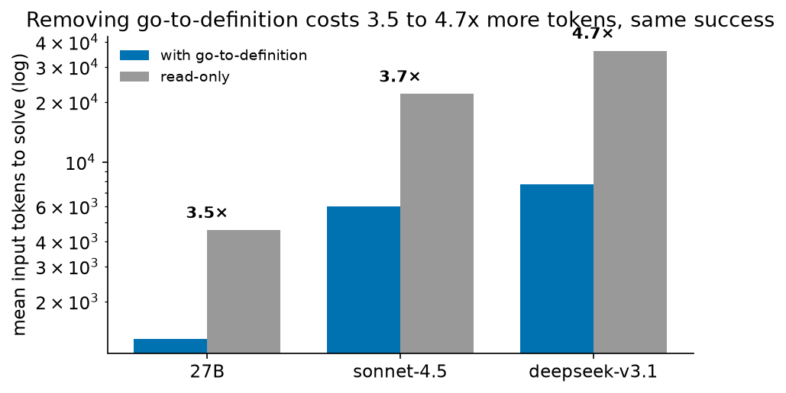
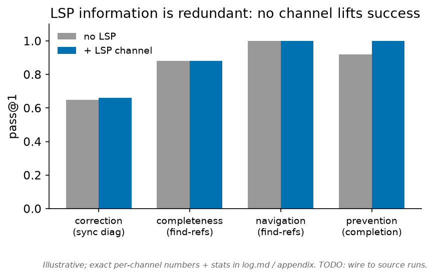
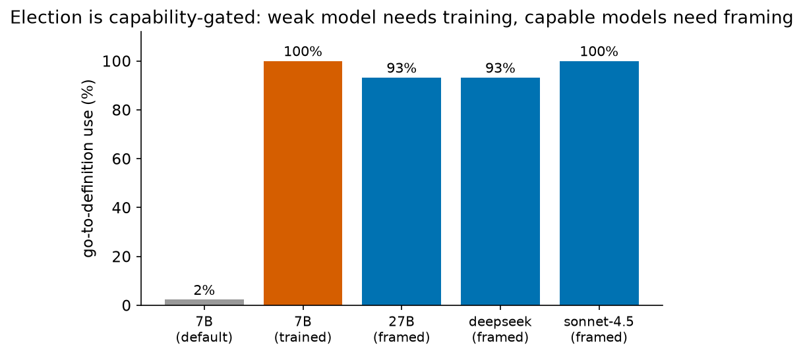
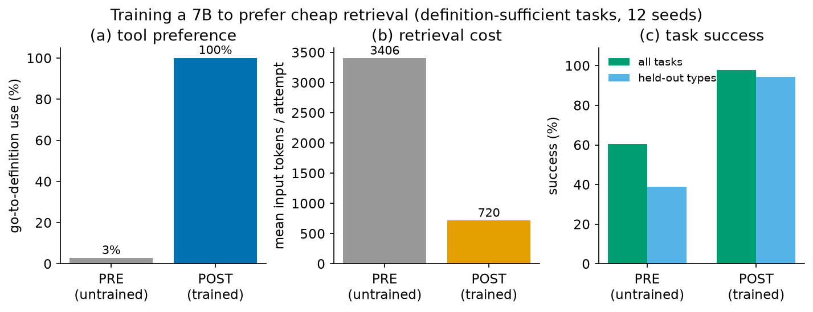
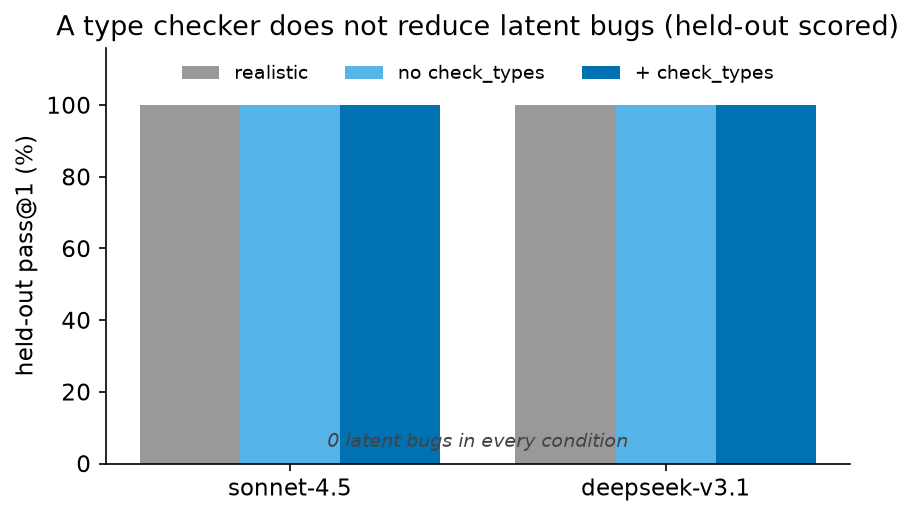
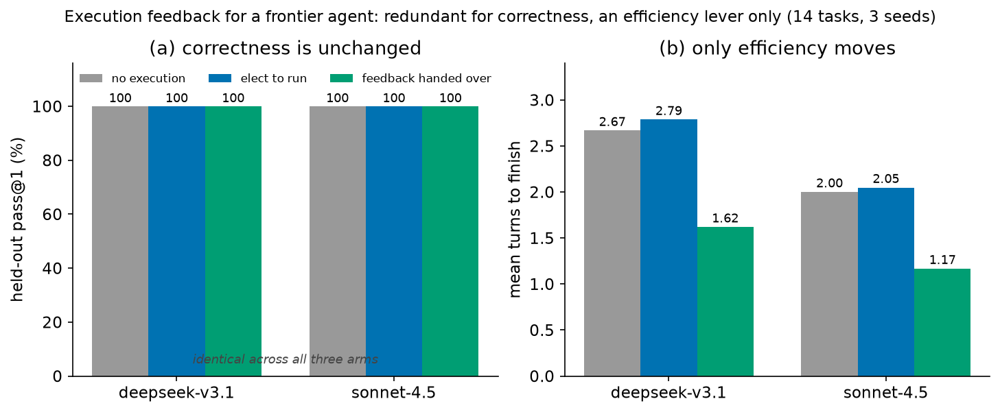

# The Value Is the Type, Not the Language Server

## When Does a Language Server Help a Coding Agent?

> **Status: stable findings, draft writeup.** The current result has converged on a narrower and more
> useful claim than "language servers help agents." A go-to-definition action is a real token win against a forced
> whole-file-read baseline, but that win largely disappears once the counterfactual is a capable bash
> agent's ordinary `grep` plus ranged `sed` retrieval. The sharper semantic-precision case also comes out
> negative for a self-retrieving agent: when dispatch is statically resolvable, the receiver type is
> readable in source and the agent reads it; when it is not statically resolvable, static goto cannot
> resolve it either. The durable value is therefore the code's **readable, correct types**, not live LSP
> navigation over them. A type checker matters as a gate that keeps committed code self-describing; in our
> authoring tests, it does not help the agent write the code live.

| finding | status | boundary |
|---|---|---|
| LSP information is redundant when the fact is readable in budget. | Stable across tested channels. | Very large/tangled codebases remain untested. |
| Go-to-definition saves tokens against a whole-file-read baseline. | Stable controlled-baseline result. | Does not clearly transfer to grep/ranged-read agents. |
| Election is capability-gated. | Stable. | Useful mainly when the cheap action can replace an expensive read. |
| Semantic goto is redundant when receiver types are readable. | Stable on dispatch suite and real probe. | More real tasks would sharpen external validity, not the mechanism. |
| Type-checker feedback does not help live authoring in tested regimes. | Stable for 27B/7B authoring suite. | Harder authoring tasks may move the boundary. |

## Abstract

Do language servers help coding agents because they supply information, retrieve context cheaply, or
resolve symbols semantically? We measure each channel across synthetic and real-repository tasks, a 7B and
a 27B open model, and frontier models in a tool-calling loop, by toggling each capability at fixed model
capability. The central finding is that the **type information written in the code** is more valuable than
live language-server access to it. LSP information (diagnostics, references, completion, type inference,
and even execution feedback as a boundary check) does not raise success when the agent can derive the same
fact by reading source in budget. Go-to-definition does cut input tokens 3.5 to 4.7 times at equal success,
but only in the controlled counterfactual where retrieval is required, the alternative is a whole-file
read, and the agent chooses the cheap action. A capable model chooses it from prompt framing; a 7B has to
be trained to (near-zero to 100% use, 4.5 times fewer tokens).

That efficiency result does not generalize cleanly to a capable bash agent, which already retrieves with
`grep` and ranged `sed` and often reads the file after using goto anyway. We then tested the stronger case
for a language server, semantic precision under ambiguous dispatch. It also does not help a capable
self-retrieving agent: on a 15-task dispatch suite built to favor goto, the capable 27B resolves which
override binds by reading the receiver type and goes straight to the right class, with a grep-versus-goto
token ratio near one. Moving the receiver type from a call-site annotation to a factory leaves cost flat,
because the agent reads the type wherever it sits. Finally, a type checker does not help live authoring: a
27B authors type-clean modules with no error to catch, while a 7B cannot act on the diagnostics and
thrashes when they are volunteered. The type system's value is therefore to keep code self-describing for
the next self-retrieving agent, not to provide live navigation or live critique during writing.

## Contributions

- **Information is redundant when it is readable in budget.** When the fact a language server would
  supply is derivable from the source by reading within the agent's read budget, handing it to a
  self-retrieving agent does not raise pass@1. This held on every channel we tested (correction,
  completeness, navigation, prevention, scale, type inference) and, as a boundary check, on the
  program's runtime behavior. It covers a lot of real code. We did not test very large or highly complex
  codebases, or facts that appear only at run time, where the fact may not be readable in budget and a
  language server may then carry information that helps.
- **Efficiency is a controlled-baseline win, not the main story.** A go-to-definition action reduces input
  tokens 3.5 to 4.7 times at equal success when retrieval is required, the counterfactual is a whole-file
  read, and the agent chooses the cheap action. But against a capable agent's own `grep` plus ranged `sed`,
  the advantage largely disappears: the agent already self-retrieves cheaply, and goto often adds a call
  rather than replacing a read.
- **Semantic precision is redundant for a capable model when types are readable.** On a dispatch domain
  built to favor language-server goto, the capable model reads the receiver type and opens the correct
  override directly; goto stays token-neutral. If dispatch is statically resolvable, the type is readable
  source; if it is not, static goto cannot resolve it either. The useful artifact is the readable type.
- **Election is capability-gated, but only matters in the controlled baseline.** A capable model chooses
  the cheap action when the system prompt frames it as cheaper (a 27B at 88 to 93%, a frontier model at
  100%); a 7B needs on-policy training (near-zero to 100%). The recipe is useful when the product really
  exposes only whole-file reads or similarly expensive retrieval.

---

## 1. Introduction

Coding agents spend most of their tokens retrieving context. A language server offers a coding agent
three plausible advantages: information (diagnostics, inferred types, reference lists), cheaper retrieval
(a go-to-definition that returns one symbol instead of a whole file), and semantic precision (the binding
of a name when textual search is ambiguous). We ask which one helps, and under what conditions.

A capable agent can read files on its own. Whatever a language server computes, it computes from
source the agent can also read, so its information may be redundant. Prior work treats
language-server feedback as a useful reward or context signal (Zhang et al., 2025); we find that
for a self-retrieving agent the information does not raise success wherever the agent can read the
source and derive it in budget. We then ask whether cheaper or more precise retrieval changes the agent's
path enough to matter.

Whether an agent then uses a cheaper retrieval action is a policy question, not an information one.
An agent will not use a cheaper action because it exists. We separate the information value from
the efficiency value by toggling each capability at fixed model capability: we run the same model
with and without a given language-server action, rather than compare a trained model to an
untrained one. We do this across two synthetic task families, real vendored library code, a 7B and
a 27B open model, and two frontier models driven through a tool-calling API.

The controlled answer is useful but narrow. On the synthetic efficiency suite a 7B moves from near-zero
to 100% go-to-definition use and from 3086 to 688 input tokens after one on-policy training round; an
untrained 27B reaches 88 to 93% use from prompt framing; a frontier model in a tool-calling loop reaches
100% use and a 3.7 times token reduction at equal success (Figure 1). Later sections show why this is not
the full story: once the baseline is a capable agent's ordinary grep-and-range-read workflow, and once
semantic dispatch is tested directly, the durable value moves from the language server to the readable
types in the code.

*Figure 1. The tool-value ablation. Removing the go-to-definition action, so the same model can
only read whole files, costs 3.5 to 4.7 times more input tokens at the same (ceiling) success, for
a 27B and two frontier models on the obscure real-code suite. Tokens on a log scale.*

## 2. Setup

**Agent and actions.** The agent fixes a bug in a target file through a try-and-correct loop. It
has five actions: `<read path>` returns a full file, `<defn sym>` returns the definition span of a
symbol, `<findrefs sym>` returns reference sites, `<test>` runs the suite, and `<edit>` applies a
line-range change. We run two harnesses. A local token-stream harness drives open-weight models
(Qwen2.5-Coder-7B-Instruct, Qwen3.6-27B) with logit access. A turn-based tool-calling harness
(`scripts/api_agent.py`) drives frontier models through the OpenRouter API, exposing the same
actions as function tools, the modality production agents use.

**`<defn>` is a real go-to-definition, not an oracle.** Given a symbol name the agent requests, the
tool AST-resolves that symbol's top-level definition against the live workspace and returns its
source span, what a language server's go-to-definition returns, with no privileged knowledge of
which symbol or what the answer is, and returning "(no definition found)" on an unresolvable name.
We validated the static resolver against a production language server. On the synthetic suite a live
`pyrefly lsp` daemon (`textDocument/definition`) resolves all 12 evaluation symbols to the same
definition as the static resolver (12/12), and a run with `<defn>` backed by the live daemon
reproduces the headline (use 0 to 100%, 2894 to 689 tokens, 58 to 100% success). On the real-code
suite the agreement holds wherever pyrefly resolves: 9 of 11 `toolz`/`more_itertools` symbols agree
with the static resolver and none disagree (pyrefly returns null on 2 `more_itertools` re-exports,
where the agent falls back to the static resolver). For real-LSP runs a persistent `pyrefly lsp`
daemon is started once per task workspace and reused across the rollout (`--lsp-defn`), rather than
spawned per query. A trained-7B run on the real-code suite with `<defn>` backed by the per-task daemon
matches the static-resolver run exactly: 18 of 22 solved, 100% go-to-definition use, identical mean
input tokens. The resolver backing the action does not change the result, because both return the same
definition span.

**Environments, synthetic and real.** The
synthetic *effic* suite buries one needed symbol in a ~370-line module, so `<read>` returns ~3500
tokens and `<defn>` returns ~50; tasks are non-guessable, so retrieval is required. A
*read-required* boundary suite inverts this: the needed symbol is unknowable without reading, so
`<defn>` cannot solve it. The real-code suites replace the synthetic module with real vendored
library source (`toolz`, `more_itertools`): `effic_real` uses familiar functions, `effic_real2`
uses obscure ones a model is unlikely to have memorized. An inference suite (`gapd`) requires a
type the type-checker infers (overload resolution, generics, union narrowing, `Protocol`,
`TypedDict`).

These are real source with constructed tasks: a small `target.py` stub calls into the vendored library,
and the target symbols are chosen for non-obvious signatures, argument order, or behavior. That isolates
retrieval cost cleanly, but it is not yet evidence about messy production codebases (multi-hop edits,
class hierarchies, imports and re-exports, generated code, project-wide symbol reasoning); §7 revisits
this.

**Metrics.** We report go-to-definition use rate, whole-file read rate, input tokens to solve, and
pass@1, with exact McNemar on success and an exact sign test on tokens over paired (task, seed)
units.

## 3. Retrieval efficiency is real, under three conditions (C1)

Because `<read X>` and `<defn X>` usually return the same symbol, the cheap action saves tokens
whenever the agent would otherwise read. We isolate this value with a **tool-value ablation**: hold
the model fixed and toggle the action, rather than compare a trained model to an untrained one.

| setting | model | tokens with `<defn>` | tokens read-only | factor | success |
|---|---|---|---|---|---|
| synthetic, matched success | 7B (trained-`<defn>` vs trained-`<read>`) | 684 | 3191 | 4.7× | 1.00 = 1.00 |
| real obscure (`effic_real2`) | 27B | 1302 | 4563 | 3.5× | 1.00 = 1.00 |
| real, tool-calling | claude-sonnet-4.5 | 6018 | 21985 | 3.7× | 1.00 = 1.00 |
| real, tool-calling | deepseek-chat-v3.1 | 7705 | 36192 | 4.7× | 1.00 = 1.00 |

*Mean input tokens to solve, at matched success in every row: the action is toggled with capability
held fixed. The 7B row is a matched-success control, both policies trained to retrieve but one via
`<read>` and one via `<defn>`, so the 4.7× gap is the action choice alone and not a success gain (sign
test p=6.8e-4 on tasks both solve, n=40). The 27B row is the same model with the action removed vs
present (paired sign test p=0.0013, cheaper on 33/44 cells); the frontier numbers are larger because a
tool-calling turn re-sends the growing context, so a read-only agent re-pays for the file it loaded.
The election-by-training comparison for the 7B (untrained reading, 3086 tokens at 0.65 success, vs
trained `<defn>`, 688 at 1.00) is in §4.*

The reduction holds only under three conditions, each isolated by a control.

1. **Retrieval is required.** On familiar library functions, the base model guesses the API from
   memory (35 of 41 successes solve with no retrieval at all), so there is no read to replace and the
   saving disappears. On obscure functions the guess fails and retrieval is required. This is why we
   report the clean ratios on the obscure suite.
2. **The counterfactual is a whole-file read.** The saving is `tokens(read) − tokens(defn)`, realized
   only when the agent would otherwise read. A 7B guesses rather than reads even when it cannot (it
   thrashes on 18 of 20 failures without reading), so the per-call saving is absent for it; a 27B and a
   frontier model read, so the saving is present.
3. **The agent chooses the cheap action.** Availability is not use (§4).

The cost-gap question needs a task where the agent must read one file to edit another, so a cheaper
read can pay off; the symbol is consulted, not edited. The vendored-library suites are built for this.
An off-the-shelf option, RefactorBench (Gautam et al., 2025), edits the symbol's own file, so the agent
loads that file to edit it regardless of `<defn>` and efficiency has nothing to save, which is why we
did not use it.

### 3.4 In the wild, a capable bash agent's grep and sed match go-to-definition

The three conditions above make the efficiency win contingent, and condition (2), that the counterfactual
is a whole-file read, is the one most in doubt outside the synthetic suite. Our `<read>` action returns a
whole file because that is the only read the synthetic harness offers. A production agent has a shell, and
a shell can read a *range*. So we asked whether the win survives when the baseline is not a forced
whole-file read but a competent agent using ordinary shell primitives.

**Setup.** We drive **mini-swe-agent** (a minimal, credible bash-only SWE agent) on SWE-bench Verified
tasks, inside each task's own Docker container, so the agent gets real test feedback in the loop. The
language server is exposed as a shell command, `codenav defn SYMBOL` / `codenav refs SYMBOL` (an
AST-backed go-to-definition and find-references, the same resolution `<defn>` uses), and ablated by
presence: **R** bash only, **D** `codenav` installed and advertised, **D+** `codenav` plus a strong
system-prompt directive to prefer it over reading files. We run three tasks whose fix genuinely depends on
a symbol defined in a large other file (`astropy-14182` `QTable` 4247 lines, `sympy-14531` `Normal` 2987
lines, `sphinx-8265` `Index`), one seed each. The reported quantity is behavioural: input tokens per model
call (which normalises for step count), and how the agent actually retrieves.

| task | arm | input tokens / call | `codenav` calls | whole-file reads | exit |
|---|---|---:|---:|---:|---|
| astropy | R | 16952 | 0 | 3 | submitted patch |
| astropy | D | 16721 | 1 | 3 | step limit |
| astropy | D+ | 17975 | 7 | 2 | step limit |
| sympy | R | 19763 | 0 | 2 | submitted patch |
| sympy | D | 19742 | 0 | 2 | step limit |
| sympy | D+ | 18651 | 5 | 1 | step limit |
| sphinx | R | 22951 | 0 | 1 | step limit |
| sphinx | D | 17217 | 8 | 0 | step limit |
| sphinx | D+ | 17262 | 0 | 3 | step limit |

Three things hold up, robust to the confounds below.

1. **Election is prompt-liftable, even in a real agent.** Strong framing raised go-to-definition use where
   mild advertisement did not (astropy 0/1/7, sympy 0/0/5), consistent with §4, now shown in the wild.
   (Noisy at one seed: sphinx went 0/8/0.)
2. **Eliciting it does not lower token cost.** Per-call input tokens do not fall when `codenav` is used:
   the heaviest-`codenav` arm (astropy D+, 7 calls) is the *fattest*, and sphinx's two lean arms include
   one that used `codenav` zero times. There is no `codenav`-to-savings effect.
3. **The whole-file-read counterfactual barely occurs.** Whole-file reads are 0 to 3 per 44 to 60 actions
   in every arm; the agent retrieves with `grep` and ranged `sed -n`. The expensive read the synthetic
   3.5 to 4.7 times beat is not what a capable bash agent does.

**Why: go-to-definition is additive, not substitutive.** Cross-checking each `codenav defn SYMBOL`
against the trajectory's reads, in roughly 16 of 18 defn calls the agent *also read the same file it just
resolved*, via grep or sed, often heavily: sympy's D+ arm resolved three symbols in `str.py` and still
`sed`-read `str.py` 22 times; astropy's D+ arm resolved three symbols in `rst.py` and still `cat`-read the
whole `rst.py`. A definition *span* is not what makes a fix. The agent needs the edit site, the surrounding
context, the tests, and the call sites, which is a read of the file, and the isolated definition does not
provide it. So go-to-definition does not displace a read; it is one more call on top of the reads the
agent makes anyway. A concrete existence proof: astropy-14182's R arm submitted a real patch using eight
`grep`, two `sed`, three `cat`, and *zero* `codenav`, fixing a task that involves `QTable` (4247 lines)
without ever reading its definition or touching the language server.

**Reading of this.** For a capable agent with shell primitives, go-to-definition is efficiency-neutral:
`grep` plus ranged `sed` already retrieves the same symbol as cheaply, so the language server's residual
efficiency value, which §3 established against a whole-file read, does not clearly transfer. The synthetic
3.5 to 4.7 times is a property of the forced whole-file-read baseline, not of retrieval in the wild. This
left the stronger semantic question: can a language server beat textual search when the symbol name is
ambiguous? §3.5 tests that case directly.

*Caveats. One seed per cell, three tasks, one model (`claude-sonnet-4.5`), and a 60-step cap under which
only the two R arms converged, so there is no matched-success cell here and the raw off/on token ratios
are confounded by termination; the per-call tokens and the retrieval-behaviour distribution are the
reliable lenses, not the ratios. The setup and per-arm logs are in `docs/real_repo_progress.md` and
`scripts/realbench/mini_ablate.py`.*

### 3.5 Precision and efficiency: redundant for a capable agent when the receiver type is readable

§3.4 concerns retrieval cost. A sharper case for a language server is *precision under ambiguity*: when a
method name is defined on many classes, `grep def foo` returns every one and cannot say which override
binds for a given object, whereas a type-aware go-to-definition resolves the receiver's type and returns
the single correct one. We built that tool (`pyrefly_nav goto`, backed by the pyrefly language server;
`goto x.foo()` with `x: Sub` resolves to `Sub.foo`, not the base or an unrelated same-named method) and
tested it on a real dispatch-ambiguous task, running natively so the agent gets real in-loop test feedback.

On django-11211 the fix edits one of **21** `get_prep_value` overrides (`grep def get_prep_value` returns
all 21). We ran the agent (`claude-sonnet-4.5`) with grep and sed only (G) and with `pyrefly_nav goto`
installed and advertised (T). Both **resolved** the task, held-out tests passing. But the T arm **never
called** the type-aware tool: it localized the correct override by grep-and-read, exactly as G did. So
precision joins information and efficiency. Where the agent can read the source, a language server's
receiver-aware resolution does not change the outcome, because the agent disambiguates by reading.

Two honest limits framed that as a probe, so we then ran the efficiency test directly. A controlled
dispatch suite of fifteen tasks (a method overridden on eight to fifteen classes, a statically typed
receiver in `app.py`, one buggy override, and a pytest that fails at base and passes on the right fix, with
a real pyrefly go-to-definition tool) was driven by two local models, Qwen2.5-Coder-7B and Qwen3.6-27B,
under three arms: `grep` plus ranged read only, the tool available, and the tool prompted as the cheap way
to pick the right override. The measure is input tokens at matched success plus a paired per-task delta.

The result is a clean negative for a capable model, and it points somewhere more interesting than the
tool. The 27B resolves 15 of 15 under every arm, and the paired token ratio of `grep` versus
go-to-definition is essentially one (0.97 with the tool merely available, 1.04 with it prompted; per-task
deltas small and mixed, with occasional thrash outliers in both directions). The mechanism is the point:
in the `grep`-only arm the 27B barely greps (0.3 calls per task), and its first action is to open the
single correct override file. It reads the receiver's type annotation, maps the type to the class, and
goes straight there. The weak 7B does not benefit either: it resolves only two to four of fifteen with the
solved sets disjoint across arms (so no matched-success pair exists and the efficiency delta is
undefined), and prompting it to prefer the tool makes both its resolution and its token cost worse,
because its bottleneck is multi-file edit competence, not retrieval or election. So the synthetic 3.5 to
4.7 times win (§3, against a whole-file read) does not transfer to this realistic baseline, in the very
domain built to favour the language server.

The reframe this forces is the useful finding. The 27B localizes for free because the code carries a
correct type annotation, which it reads. That is *why* the language server is redundant: the fact goto
would compute, which override binds for this receiver, is already written in the source as a type the
model reads. The argument closes on itself. If dispatch is statically resolvable the type is in the source
and the agent reads it, so navigation is redundant; if it is not statically resolvable it is dynamic, and
the server's static goto cannot resolve it either. Navigation never beats a readable type. So the value is
not in the language server's navigation, it is in the types themselves, and a type checker's contribution
is keeping those annotations correct so the code stays self-describing, not feeding the agent a live
lookup. We then measured how much the annotation is worth by stripping it: moving the receiver type from
the call-site annotation to the test's construction to a return-annotated factory leaves the capable
model's cost flat (grep-only input tokens of 1436, 1429, and 1465 across the three), because the type
stays somewhere in the source the model reads, and go-to-definition stays neutral (ratio 0.98 to 1.07)
even in the factory case where it does resolve. So it is readable type information, wherever it sits, that
carries the localization, not the call-site annotation specifically and not the language server. §5 tests
the other side of the type-system reframe: whether the checker helps the agent write typed code live.

## 4. Election is capability-gated (C2)

Conditions (1) and (2) are properties of the task and the model's reading habit. Condition (3), that
the agent chooses the cheap action, is the practitioner's lever, and it depends on model capability.

| model | `<defn>` use by default | `<defn>` use when framed as cheaper | trained |
|---|---|---|---|
| 7B (Qwen2.5-Coder) | 2% | 2% | 100% (after one on-policy round) |
| 27B (Qwen3.6) | 0% | 88% | not needed |
| deepseek-chat-v3.1 | n/a | 93% | not needed |
| claude-sonnet-4.5 | n/a | 100% | not needed |

*Figure 2. Election is capability-gated, on the obscure real-code suite. A 7B uses go-to-definition
2% of the time by default and 100% after one on-policy training round; a 27B and two frontier models
reach 93 to 100% from prompt framing alone.*

**A weak model needs training.** The 7B uses `<defn>` 2% of the time by default, and a prompt
instructing it to prefer `<defn>` leaves use near 0%. Offline imitation of cheap `<defn>` trajectories
also fails: use stays near 0% and tokens do not fall, because the demonstrations never show the
expensive action available and the cheap one chosen, so the cloned policy is unconstrained exactly
where the preference must be expressed.

On-policy imitation fixes the distribution mismatch. We roll out the untrained agent with both actions
available; where it emits `<read>` for a non-editable file and the needed symbol is resolvable, we drop
that step and let the agent emit `<defn sym>` itself, keeping the rest of its trajectory; we fine-tune a
LoRA adapter on the relabeled trajectories (one DAgger round). No gold action is injected: we relabel
only the retrieval channel of the agent's own behavior. The 7B then moves to 100% use, success 0.65 to
1.00, and 3086 to 688 input tokens (McNemar success p=1.5e-5, b=17/c=0; sign test tokens p=2.2e-4,
cheaper on 37/48). The preference generalizes to held-out task types (0.42 to 1.00 success, 5.2× tokens),
transfers unchanged to real `toolz`/`more_itertools` code (100% `<defn>` use, correct non-idiomatic calls
from the retrieved signature), and preserves a read-when-needed boundary: on read-required tasks the
trained agent still reads 100% of the time and success rises (0.54 to 0.83). A cost-reward GRPO objective
reaches the same operating point (Appendix A), so an independent training signal instills the same
preference.

**A capable model needs only framing.** The same prompt that leaves the 7B at 2% moves an untrained 27B
to 88% use, with no training. Framing the action in the system prompt as cheaper than a read is what does
it. A control isolates the framing from the rest of the prompt: on the identical synthetic 2-file suite,
an older prompt that mentioned `<defn>` only in the task message gave 0% use and 4058 tokens, while the
current prompt, which presents `<defn>` beside the read instruction as the cheaper option, gives 88% use
and 1237 tokens. Frontier models go further: `claude-sonnet-4.5` chooses `<defn>` on 100% of rollouts and
`deepseek-chat-v3.1` on 93%, with no training.

*Figure 3. The on-policy training win for a 7B on definition-sufficient tasks (12 seeds):
go-to-definition use rises to 100%, mean input tokens fall, and success rises on all tasks and on
held-out task types.*

*Figure 4. The learned policy is a boundary, not a collapse. On definition-sufficient tasks the
trained 7B uses go-to-definition; on read-required tasks it still reads.*

## 5. Language-server information is redundant (C3)

We tested whether the information a language server provides, as opposed to a cheaper way to
retrieve it, raises success for a self-retrieving agent. In the self-retrieval regimes we test it does
not, on any channel, when the same fact is readable within the agent's read budget: the agent reads the
source and derives the fact itself, so the information is redundant there. This is bounded evidence, not
a claim that diagnostics or types never help; §7 states where it need not hold.

**Correction.** An oracle ladder replaces the diagnostic with progressively stronger feedback: no
feedback, synchronous diagnostics, perfect error localization, and the gold fix. For a 7B, perfect
localization lowers pass@1 (0.45 to 0.25, p<0.001), and the gold fix does not beat no-feedback
(0.39 vs 0.45, p=0.29), a capability floor rather than an information gain. A 35B mixture-of-experts
model ceilings the suite. The diagnostic adds nothing the agent does not already read.

**Completeness, scale, navigation, prevention.** Varying repository size from 21 to 86 files at a
fixed read budget, success stays at 1.00 with 6 to 8 reads, and find-references does not earn its
keep, because reading does not become expensive at tractable scale. When name search fails on a
re-exported symbol, the agent reads the call graph and succeeds without find-references. The agent
reads a library before calling its API and does not emit the hallucinated member, so completion has
nothing to prevent.

**Inference.** The last channel is type inference, and it is the one where a type checker is usually
the *unique* detector: a wrong usage that the test does not exercise. We test it directly with
**held-out scoring**. Each of six tasks (overload resolution, optional `None`, union narrowing,
`TypedDict`) has a plausible wrong fix that *passes a visible test the agent runs but fails a hidden
held-out test*, and that pyrefly flags statically (`sum(int | None)`, an unknown `TypedDict` key,
`NoneType has no attribute`). We give two frontier models a `check_types()` tool that surfaces those
diagnostics, told the visible test is partial, and also run a realistic condition with no such hint.
The checker changes nothing. In every condition both models solve **18/18 with zero latent bugs**,
with and without the checker, and even when they elect it. The models write the correct fix by careful
reading and do not ship the inference bug for the checker to catch.

| condition | deepseek-v3.1 | claude-sonnet-4.5 |
|---|---|---|
| realistic (no hint, no checker) | 18/18 | 18/18 |
| hinted, no checker | 18/18 | 18/18 |
| hinted, `check_types()` available | 18/18 | 18/18 |

*Held-out pass@1 on the six rich tasks (3 seeds, n=18): every cell is 18/18, zero latent bugs. When the
checker is available both models call it (deepseek on all 18 rollouts, sonnet on 10 of 18), and the
outcome is unchanged.*

**Authoring.** That test toggles the checker on *bug fixes*, where the point is that a wrong fix can be
well-typed. A different regime is *authoring*, where the agent writes a larger module from a spec and type
errors arise organically across a bigger surface (undefined names, wrong signatures, bad imports, arity,
attribute access), so fast checker feedback could in principle pay. We test it with a twelve-task
authoring suite (each a typed stub the agent implements, with held-out scoring and a residual-type-error
count on the final submission) under three arms: no checker, an elective `check_types` action, and one
that volunteers the checker's diagnostics after every edit. It helps at neither capability tier, for two
mirror-image reasons. The capable model (Qwen3.6-27B) authors all twelve modules correctly and essentially
type-clean in a single edit (12/12 held-out in every arm), so there is no error to catch; it never elects
the checker, and the volunteered diagnostics report nothing. The weak model (Qwen2.5-Coder-7B) does make
type errors but cannot use the checker to fix them: its best arm is *no checker* (6/12, against 3/12 and
4/12 with it), its residual type errors are flat at about two per task across all three arms, and
volunteering diagnostics after every edit floods it into thrash (10.4 edits and 2.3 times the tokens of
the no-checker arm) while cleaning nothing up. It sees the diagnostics and cannot act on them, the same
edit-competence ceiling that stopped it converting a resolved definition into a correct edit in §3.5. So
the checker is redundant for the model that does not need it and unusable for the model that does, at
authoring just as at bug-fixing.

A language server computes from source the agent can also read. Across correction, completeness,
navigation, prevention, scale, and type inference, a capable agent reads that source and derives the
same fact, so the information is redundant and the value of a language server is the cost of retrieval,
not its content. This holds wherever the fact is readable in budget, which covers most everyday code. It
need not hold where the fact is not readable in budget: a codebase too large or too tangled to read under
budget, or an inference a frontier model reliably gets wrong while the visible test misses it. We did not
find such a case, the inference tasks were an adversarial reviewer's plausible-error designs and the
models still did not err, but we did not rule one out (§7).

*Figure 5. The held-out-scored inference test. A `check_types()` tool does not raise pass@1: both
frontier models solve 18/18 with zero latent bugs, with the checker, without it, and in a realistic
no-hint condition. The plausible wrong fix passes the visible test the agent runs but fails the hidden
test and is flagged by pyrefly; the models write the correct fix anyway.*

**Execution.** Every channel above serves a fact already in the source. We also tested a fact that is
not in the text: the program's runtime behavior, which the agent can get right only by mentally
executing the code and verify only by running it. Fourteen small bug-fix tasks each have a plausible
wrong fix that fails a visible test (so running is a detector) yet is well-typed (so a checker is
useless and execution is the only in-budget detector), scored held-out. Two frontier models run under
three arms: no execution (the run-tests tool is removed and the agent reasons from the source and the
shown spec), elect-to-run (the agent may run the visible test), and feedback-handed-over (the
environment volunteers the test result after every edit). Five tasks are Python-semantic traps whose
plausible reimplementation mis-simulates a real behavior (`str.lstrip` strips a character set, not a
prefix; `int(x/k)` truncates where `//` floors; `round` is banker's rounding). Across 252 rollouts both
models solve every task in every arm, 100% held-out pass@1, including with no execution at all. The only
quantity that moves is efficiency: handing the result over (1.39 turns) is cheaper than electing to run
it (2.42) at identical success. So execution feedback does not raise correctness here, it only saves
turns, where the code is small enough to read or simulate reliably. Execution feedback does raise success
in other regimes, harder generation and weaker models (§6); we did not find the scale at which it becomes
the only detector for a frontier agent (§7).

*Figure 6. Execution feedback is redundant for a frontier agent on small bug-fixes. Across 14 tasks,
two models, and three seeds, held-out pass@1 is 100% whether the agent cannot run the code, elects to
run it, or is handed the result for free (a). The only effect is efficiency: volunteering the result
finishes in fewer turns (b).*

## 6. Related work

Our method is on-policy imitation under distribution shift. GKD (Agarwal et al., ICLR 2024) distills a
teacher under the student's own distribution; DAgger (Ross, Gordon & Bagnell, AISTATS 2011) and cost-aware
AggreVaTe (Ross & Bagnell, 2014) ground rolling out a learned policy and relabeling with an expert;
Revisiting DAgger for LLM agents (Li et al., 2026) applies the idea to tool-using language models. STaR
(Zelikman et al., 2022) bootstraps reasoning from the model's own rationales; we bootstrap a cost
preference from the model's own trajectories. The expert here is a deterministic read-to-defn relabel,
not a model.

Cost-aware tool use through RL is the alternative we corroborate but do not require. OTC-PO (Wang et al.,
2025) and IKEA (Huang et al., 2025) reward fewer or cheaper tool calls; their results motivate that a
token-cost reward learns the same preference we obtain by on-policy imitation, which our GRPO
corroboration confirms (Appendix A).

Language servers as a supervision signal. RLCSF (Zhang et al., 2025) takes the complementary view that
compiler and language-server signals, including diagnostics, symbol resolution, type information, and
references, are a valuable supervision signal for a coding agent, and builds a reinforcement-learning
system around exposing them. It is a methodology contribution and reports no empirical comparison of that
information against plain source reading. Our result supplies one: in the channels we tested, a
self-retrieving agent recovers those facts by reading, so supplying them does not raise pass@1, and the
value we measure is retrieval cost.

Redundant retrieval for capable models. Outside code, the same pattern is documented: a tool or retrieval
call can be redundant or net-negative when the model already holds the answer. "To Call or Not to Call"
(Wu et al., 2026) reports tool calls with negative utility in roughly a third of cases when the model
succeeds without them, and IKEA (Huang et al., 2025) reports search agents over-retrieving rather than
using what they already know. Our finding is the language-server instance of the same effect, measured
against code-agent pass@1.

Feedback that carries new information. Execution-grounded feedback can raise code-generation success:
Self-Debugging (Chen et al., 2024) feeds runtime results back to the model, RLTF (Liu et al., 2023) trains
on unit-test outcomes, and type-constrained decoding (Mündler et al., 2025) enforces well-typedness during
generation; self-repair gives only modest gains once its cost is counted (Olausson et al., 2024). These
signals are not in the source text the agent reads: they are the program's behavior at run time, or a
constraint imposed during decoding. Our §5 execution test is the case where the agent can recover the
behavior from small code by reading or simulating it, and there the feedback only saves turns. Execution
feedback helps in the harder-generation and weaker-model settings these works study, and is redundant in
ours.

## 7. Limitations

- **The cost gap is engineered, but validated.** The synthetic suite sets the read-versus-defn cost gap
  and the non-guessability of tasks. We validate that the effect survives on real vendored library code
  and at the frontier in the tool-calling modality (§3), but the read-required boundary covers two reasons
  a read is needed (name-hidden, many-symbol), not all.
- **The efficiency win is scoped to a whole-file-read baseline.** Our
  in-the-wild probe (§3.4) finds that a capable bash agent retrieves with `grep` plus ranged `sed` rather
  than whole-file reads, so go-to-definition saves little against it, and when prompted to use it the
  agent reads the file anyway. This is early evidence (one model, three tasks, one seed), but it scopes
  the efficiency result to the whole-file-read counterfactual. The sharper question is where a
  language server's *semantic* resolution supplies information a *textual* `grep` cannot. Two regimes look
  promising. Receiver-type and overload disambiguation: `x.foo()` binds to `foo` on the type of `x`, but
  `grep def foo` returns every same-named method on every class (`def add` has 15 definitions in django,
  `def append` has 7 in astropy), and when the receiver is a builtin the real definition is not in the
  repo at all. Indirection: factory-assigned, singleton, and re-exported symbols have no `def`/`class`
  statement (`take = _dask_or_eager_func("take")` in xarray, `I = S.ImaginaryUnit` in sympy), so grep and
  our AST resolver both return nothing, and only a binding-aware server resolves them. We have in-house
  evidence the failure is real: the shallow AST resolver that built our candidate pool mis-resolved
  exactly these common-name cases (it flagged `add`/`lower`/`append`/`rjust` to a same-named template
  filter when the true receiver is a builtin), which a type-aware go-to-definition would not. The honest
  counter is that a capable agent infers the receiver type by reading the call site, so this likely
  changes its path (steps, mis-localization) more than its *outcome*. Both probes (§3.5) bear this out and
  then close the question. On a real dispatch-ambiguous task (django-11211, a method with 21 overrides) the
  frontier agent resolved it either way and never elected the tool. On a controlled fifteen-task dispatch
  suite driven by two local models, the capable 27B resolved 15 of 15 under every arm with a `grep`-versus
  go-to-definition token ratio of essentially one (0.97 to 1.04), because in the `grep` arm it barely greps
  (0.3 calls per task) and opens the correct override file directly, having read the receiver's type; the
  weak 7B did not benefit and prompting it toward the tool made both its resolution and its cost worse. So
  precision and efficiency are both redundant here, and for the same reason: the disambiguator, the
  receiver's type, is written in the source and the agent reads it. This closes the efficiency question
  with a clean negative and reframes the whole result. If dispatch is statically resolvable the type is
  readable and navigation is redundant; if it is not, dispatch is dynamic and a static goto cannot resolve
  it either, so navigation never beats a readable type. The value is in the types, not the navigation over
  them. That turns the question from the language server to the type system, and we ran both halves.
  Stripping the receiver type from the call-site annotation to a return-annotated factory leaves the capable
  model's cost flat (grep-only tokens of 1436, 1429, 1465 across the three), because it reads the type
  wherever it sits; the annotation's location does not matter, only that the type is readable. And a type
  checker does not help when *authoring* new code either (§5 authoring extension): the capable model writes
  type-clean modules with no error to catch, and the weak model cannot act on the diagnostics and is flooded
  by them, its best arm being no checker. So both halves confirm the reframe: the type system's value is a
  readable, correct type, not a language server that navigates it or a checker that critiques the writing of
  it.
- **Redundancy holds where the fact is readable in budget.** Across the channels we tested, the language
  server's information is redundant for a self-retrieving agent, because the agent reads the source and
  derives the fact within its read budget. A fact the agent cannot recover by reading, a runtime value it would have to execute for, an
  inference beyond the model's reach, or a codebase too large to read under budget, could make it
  non-redundant. We did not find such a case but did not rule one out.
- **The inference null is bounded by task difficulty.** Our held-out-scored inference test (§5) covers the
  regime where a type checker is usually the unique detector (a wrong usage the visible test misses), and
  frontier models still solve 18/18 with zero latent bugs. We did not find an inference a frontier model
  *reliably gets wrong* while the visible test misses it; the tasks were an adversarial reviewer's
  plausible-error designs and the models did not err, so we cannot rule out that harder inference exists
  where a checker would prove non-redundant. We also did not test the cross-file regime where the relevant
  definitions are too many to read under the budget.
- **The execution null is bounded by task scale.** The execution test (§5) covers small, self-contained
  bug-fixes where a frontier model simulates the code reliably, and there both models solve 14/14 in every
  arm. We deliberately stress-tested simulation with Python-semantic traps and the models still did not err,
  but we did not find the scale or opacity (long programs, behavior behind a dependency the agent did not
  read, genuine nondeterminism) at which execution becomes the unique in-budget detector. Published results
  show execution feedback helps in harder-generation and weaker-model regimes (§6); our null is the
  frontier-on-small-tasks corner, not a claim that execution never helps.
- **Tool-calling token accounting.** The API harness re-sends context each turn, so its absolute token
  counts are not comparable to the local harness; we report within-harness ratios at equal success.

## 8. Conclusion

The main payoff is not live language-server access; it is typed code that stays readable and correct.
Against a whole-file-read baseline, go-to-definition is a real efficiency tool: it cuts input tokens 3.5
to 4.7 times at equal success when retrieval is required, the alternative is a whole-file read, and the
agent chooses the cheap action. Election is the practitioner's lever in that regime: a capable model uses
the action when the prompt frames it as cheaper, while a weak model needs on-policy imitation.

But that is a controlled-baseline result. A capable agent with a shell does not normally read whole files;
it uses `grep` and ranged `sed`, and go-to-definition adds a call more often than it replaces a read. The
semantic-precision case closes the same way. On a dispatch domain built to favour language-server goto,
the capable model resolves which override binds by reading the receiver's type, so goto is token-neutral;
where the type is not statically readable, static goto cannot resolve the dispatch either. Moving the type
from a call-site annotation to a return-annotated factory leaves cost flat because the model reads the type
wherever it sits. A type checker also does not help the agent write typed code live: the capable model has
no errors to catch, and the weak model cannot act on the diagnostics.

So the type system's value is the types being present and correct. A checker is valuable as a gate on
committed code, keeping the codebase self-describing for the next self-retrieving agent; it is not, in the
regimes we tested, a useful live navigator or live authoring critic.

**The recipe.** Expose go-to-definition as an action, not diagnostics as context. Frame it in the system
prompt as cheaper than a whole-file read; a capable model then uses it without training. If the model is
weak enough to ignore the framing, train the preference on-policy by relabeling its own reads to
definitions. Mix in tasks that genuinely need a full read, so the agent learns when the cheap action
suffices.

---

## Appendix A: cost-reward RL corroboration

A GRPO objective (reward: solve at minimum tokens, group-normalized advantage over the model's own action
tokens) reaches the same operating point as the on-policy relabel, over four rounds. A single round
under-trains.

| stage | `<defn>` use | mean input tokens | solved |
|---|---|---|---|
| wild (round 0) | 37% | 2048 | 67% |
| after 1 round | 6% | 3041 | regressed |
| after 4 rounds (harvest) | 86% | 790 | n/a |
| clean held-out retest | 86% | 663 | 100% |

GRPO corroborates that a token-cost objective instills the same preference; the SFT relabel remains the
recipe because it needs one round.

## Appendix B: cross-scale transfer of the training recipe

The same relabel pipeline on Qwen3.6-27B (a different generation and a reasoning model) gives the same
result.

| | `<defn>` use | read use | mean input tokens | success |
|---|---|---|---|---|
| wild 27B | 0% | 96% | 4058 | 0.96 |
| trained 27B | 100% | 0% | 726 | 1.00 |

The token reduction at matched success is 5.5× (n=24). The recipe is not a small-model artifact and
transfers across a roughly 4× scale jump and a model-family change.

## Appendix C: models, versions, and cost accounting

Closed-model results date quickly, so we record the exact configuration. Frontier models were driven
through the OpenRouter API by `scripts/api_agent.py`; open models were run locally with logit access on a
single NVIDIA DGX Spark (GB10, 128 GB unified memory).

| role | model id | provider | runs |
|---|---|---|---|
| 7B | `Qwen/Qwen2.5-Coder-7B-Instruct` | local (HF) | training, ablation |
| 27B | `Qwen/Qwen3.6-27B` | local (HF) | ablation, transfer |
| frontier | `anthropic/claude-sonnet-4.5` | OpenRouter | efficiency, election, inference, execution |
| frontier | `deepseek/deepseek-chat-v3.1` | OpenRouter | efficiency, election, inference, execution |

Frontier runs were executed 2026-06-28 to 2026-06-30. Temperature is 0.0 for the tool-value ablation and
election runs (deterministic), and 0.7 for the held-out inference (`gapd2`) and execution-feedback
(`runtime`) suites, where we sample variation across seeds. Cost is estimated per rollout from the
per-token prices fetched once from the OpenRouter `/models` endpoint times the recorded `prompt_tokens`
and `completion_tokens`; `api_agent.py` writes `est_cost_usd` per rollout and stops before any call that
would exceed a hard `--budget-usd` cap. No prompt caching is assumed: a tool-calling turn re-sends the
growing context, which is why absolute frontier token counts are larger and are compared only within the
same harness (§7).

## References

Generated from `docs/bibliography_efficiency.bib`. Method entries were verified against the arXiv
abstract page on 2026-06-20 and the related-work entries on 2026-06-30.

- Agarwal, R., Vieillard, N., Zhou, Y., et al. (2024). On-Policy Distillation of Language Models: Learning from Self-Generated Mistakes (GKD). ICLR. arXiv:2306.13649.
- Chen, X., Lin, M., Schärli, N., Zhou, D. (2024). Teaching Large Language Models to Self-Debug. ICLR. arXiv:2304.05128.
- Gautam, D., Garg, S., Jang, J., Sundaresan, N., Zilouchian Moghaddam, R. (2025). RefactorBench: Evaluating Stateful Reasoning in Language Agents Through Code. ICLR. arXiv:2503.07832.
- Huang, Z., Yuan, X., Ju, Y., Zhao, J., Liu, K. (2025). Reinforced Internal-External Knowledge Synergistic Reasoning for Efficient Adaptive Search Agent (IKEA). arXiv:2505.07596.
- Li, C., Qiang, R., Huang, J., et al. (2026). Revisiting DAgger in the Era of LLM-Agents. arXiv:2605.12913.
- Liu, J., Zhu, Y., Xiao, K., et al. (2023). RLTF: Reinforcement Learning from Unit Test Feedback. TMLR. arXiv:2307.04349.
- Mündler, N., He, J., Wang, H., Sen, K., Song, D., Vechev, M. (2025). Type-Constrained Code Generation with Language Models. PLDI (Proc. ACM Program. Lang. 9). arXiv:2504.09246.
- Olausson, T. X., Inala, J. P., Wang, C., Gao, J., Solar-Lezama, A. (2024). Is Self-Repair a Silver Bullet for Code Generation? ICLR. arXiv:2306.09896.
- Ross, S., Gordon, G. J., Bagnell, J. A. (2011). A Reduction of Imitation Learning and Structured Prediction to No-Regret Online Learning (DAgger). AISTATS, PMLR 15.
- Ross, S., Bagnell, J. A. (2014). Reinforcement and Imitation Learning via Interactive No-Regret Learning (AggreVaTe). arXiv:1406.5979.
- Wang, H., Qian, C., Zhong, W., et al. (2025). Acting Less is Reasoning More! Teaching Model to Act Efficiently (OTC-PO). arXiv:2504.14870.
- Wu, Q., Das, S., Amani, M., et al. (2026). To Call or Not to Call: A Framework to Assess and Optimize LLM Tool Calling. arXiv:2605.00737.
- Zelikman, E., Wu, Y., Mu, J., Goodman, N. D. (2022). STaR: Bootstrapping Reasoning With Reasoning. NeurIPS. arXiv:2203.14465.
- Zhang, Y., et al. (2025). Reinforcement Learning from Compiler and Language Server Feedback (RLCSF / Lanser-CLI). arXiv:2510.22907.

---

All code, suites, result JSONs, and reproduction scripts are in the repository; see the README for how to
reproduce each number and how to test a new model.
